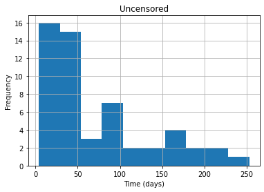
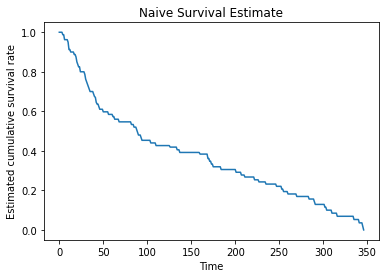
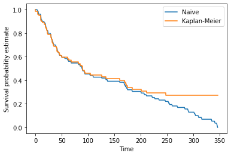

# Survival Estimates lymphoma patients
> Using Python to build some of the statistical models to analyze surivival estimates for a dataset of lymphoma patients. This is Survival estimates that vary with time.


<a href="https://colab.research.google.com/github/kirankamatmgm/Surivival-estimates-of-lymphoma-patients/blob/master/Surivival_estimates_of_lymphoma_patients.ipynb" target="_parent"></a>


### Project is based on knowledge of
- Censored Data
- Kaplan-Meier Estimates

<a name='1'></a>
## 1. Import Packages

- `lifelines` is an open-source library for data analysis.
- `numpy` is the fundamental package for scientific computing in python.
- `pandas` is what we'll use to manipulate our data.
- `matplotlib` is a plotting library.

```python
import lifelines
import numpy as np
import pandas as pd
import matplotlib.pyplot as plt

from lifelines import KaplanMeierFitter as KM
from lifelines.statistics import logrank_test
```

<a name='2'></a>
## 2. Load the Dataset


```python
from lifelines.datasets import load_lymphoma

def load_data():
    df = load_lymphoma()
    df.loc[:, 'Event'] = df.Censor
    df = df.drop(['Censor'], axis=1)
    return df
```

```python
data = load_data()
```

first look over your data.

```python
print("data shape: {}".format(data.shape))
data.head()
```

    data shape: (80, 3)


<table border="1">
  <thead>
    <tr style="text-align: right;">
      <th></th>
      <th>Stage_group</th>
      <th>Time</th>
      <th>Event</th>
    </tr>
  </thead>
  <tbody>
    <tr>
      <th>0</th>
      <td>1</td>
      <td>6</td>
      <td>1</td>
    </tr>
    <tr>
      <th>1</th>
      <td>1</td>
      <td>19</td>
      <td>1</td>
    </tr>
    <tr>
      <th>2</th>
      <td>1</td>
      <td>32</td>
      <td>1</td>
    </tr>
    <tr>
      <th>3</th>
      <td>1</td>
      <td>42</td>
      <td>1</td>
    </tr>
    <tr>
      <th>4</th>
      <td>1</td>
      <td>42</td>
      <td>1</td>
    </tr>
  </tbody>
</table>


The column `Time` states how long the patient lived before they died or were censored.

The column `Event` says whether a death was observed or not. `Event` is 1 if the event is observed (i.e. the patient died) and 0 if data was censored.

Censorship here means that the observation has ended without any observed event.
For example, let a patient be in a hospital for 100 days at most. If a patient dies after only 44 days, their event will be recorded as `Time = 44` and `Event = 1`. If a patient walks out after 100 days and dies 3 days later (103 days total), this event is not observed in our process and the corresponding row has `Time = 100` and `Event = 0`. If a patient survives for 25 years after being admitted, their data for are still `Time = 100` and `Event = 0`.

<a name='3'></a>
## 3. Censored Data

plot a histogram of the survival times to see in general how long cases survived before censorship or events.

```python
data.Time.hist();
plt.xlabel("Observation time before death or censorship (days)");
plt.ylabel("Frequency (number of patients)");
```


```python
def frac_censored(df):
    """
    Return percent of observations which were censored.
    
    Args:
        df (dataframe): dataframe which contains column 'Event' which is 
                        1 if an event occurred (death)
                        0 if the event did not occur (censored)
    Returns:
        frac_censored (float): fraction of cases which were censored. 
    """
    result = 0.0
    
    result=sum(df['Event']==0) / df.shape[0]
        
    return result
```

```python
print(frac_censored(data))
```

    0.325


see the distributions of survival times for censored and uncensored examples.

```python
df_censored = data[data.Event == 0]
df_uncensored = data[data.Event == 1]

df_censored.Time.hist()
plt.title("Censored")
plt.xlabel("Time (days)")
plt.ylabel("Frequency")
plt.show()

df_uncensored.Time.hist()
plt.title("Uncensored")
plt.xlabel("Time (days)")
plt.ylabel("Frequency")
plt.show()
```





<a name='4'></a>
## 4. Survival Estimates

estimate the survival function:


S(t) = P(T > t)


we'll start with a naive estimator of the above survival function. To estimate this quantity, we'll divide the number of people who we know lived past time $t$ by the number of people who were not censored before $t$.

Formally, let $i$ = 1, ..., $n$ be the cases, and let $t_i$ be the time when $i$ was censored or an event happened. Let $e_i= 1$ if an event was observed for $i$ and 0 otherwise. Then let $X_t = \{i : T_i > t\}$, and let $M_t = \{i : e_i = 1 \text{ or } T_i > t\}$. The estimator you will compute will be:

$$
\hat{S}(t) = \frac{|X_t|}{|M_t|}
$$


```python
def naive_estimator(t, df):
    """
    Return naive estimate for S(t), the probability
    of surviving past time t. Given by number
    of cases who survived past time t divided by the
    number of cases who weren't censored before time t.
    
    Args:
        t (int): query time
        df (dataframe): survival data. Has a Time column,
                        which says how long until that case
                        experienced an event or was censored,
                        and an Event column, which is 1 if an event
                        was observed and 0 otherwise.
    Returns:
        S_t (float): estimator for survival function evaluated at t.
    """
    S_t = 0.0
    
    S_t = (sum(df['Time']>t))/(sum((df['Time']>t)|(df['Event']==1)))
        
    return S_t
```

Check for some test cases to see if output is correct. To cross check manually calculate values and crosscheck

```python
print("Test Cases")

sample_df = pd.DataFrame(columns = ["Time", "Event"])
sample_df.Time = [5, 10, 15]
sample_df.Event = [0, 1, 0]
print("Sample dataframe for testing code:")
print(sample_df)
print("\n")

print("Test Case 1: S(3)")
print("Output: {}\n".format(naive_estimator(3, sample_df)))

print("Test Case 2: S(12)")
print("Output: {}\n".format(naive_estimator(12, sample_df)))

print("Test Case 3: S(20)")
print("Output: {}\n".format(naive_estimator(20, sample_df)))

# Test case 4
sample_df = pd.DataFrame({'Time': [5,5,10],
                          'Event': [0,1,0]
                         })
print("Test case 4: S(5)")
print(f"Output: {naive_estimator(5, sample_df)}")
```

    Test Cases
    Sample dataframe for testing code:
       Time  Event
    0     5      0
    1    10      1
    2    15      0
    
    
    Test Case 1: S(3)
    Output: 1.0
    
    Test Case 2: S(12)
    Output: 0.5
    
    Test Case 3: S(20)
    Output: 0.0
    
    Test case 4: S(5)
    Output: 0.5


We will plot the naive estimator using the real data up to the maximum time in the dataset. 

```python
max_time = data.Time.max()
x = range(0, max_time+1)
y = np.zeros(len(x))
for i, t in enumerate(x):
    y[i] = naive_estimator(t, data)
    
plt.plot(x, y)
plt.title("Naive Survival Estimate")
plt.xlabel("Time")
plt.ylabel("Estimated cumulative survival rate")
plt.show()
```





Next let's compare this with the Kaplan Meier estimate. 

Kaplan-Meier estimate:

$$
S(t) = \prod_{t_i \leq t} (1 - \frac{d_i}{n_i})
$$

where $t_i$ are the events observed in the dataset and $d_i$ is the number of deaths at time $t_i$ and $n_i$ is the number of people who we know have survived up to time $t_i$.

```python
def HomemadeKM(df):
    """
    Return KM estimate evaluated at every distinct
    time (event or censored) recorded in the dataset.
    Event times and probabilities should begin with
    time 0 and probability 1.
    
    Example:
    
    input: 
    
         Time  Censor
    0     5       0
    1    10       1
    2    15       0
    
    correct output: 
    
    event_times: [0, 5, 10, 15]
    S: [1.0, 1.0, 0.5, 0.5]
    
    Args:
        df (dataframe): dataframe which has columns for Time
                          and Event, defined as usual.
                          
    Returns:
        event_times (list of ints): array of unique event times
                                      (begins with 0).
        S (list of floats): array of survival probabilites, so that
                            S[i] = P(T > event_times[i]). This 
                            begins with 1.0 (since no one dies at time
                            0).
    """
    # individuals are considered to have survival probability 1
    # at time 0
    event_times = [0]
    p = 1.0
    S = [p]
        
    # get collection of unique observed event times
    observed_event_times = list(df.Time.unique())
  
    # sort event times
    observed_event_times = sorted(observed_event_times)
    
    # iterate through event times
    for t in observed_event_times:
  
        # compute n_t, number of people who survive to time t
        n_t = sum((df['Time'] >= t))
  
        # compute d_t, number of people who die at time t
        d_t = sum((df['Event'] == 1) & (df['Time'] == t))
        
        # update p
        p = ((n_t-d_t)/n_t)*p
  
        # update S and event_times
        event_times.append(t)
        S.append(p)
      
    return event_times, S
```

```python
print("TEST CASES:\n")


print("Test Case 1\n")

print("Test DataFrame:")
sample_df = pd.DataFrame(columns = ["Time", "Event"])
sample_df.Time = [5, 10, 15]
sample_df.Event = [0, 1, 0]
print(sample_df.head())
print("\nOutput:")
x, y = HomemadeKM(sample_df)
print("Event times: {}, Survival Probabilities: {}".format(x, y))

print("\nTest Case 2\n")

print("Test DataFrame:")

sample_df = pd.DataFrame(columns = ["Time", "Event"])
sample_df.loc[:, "Time"] = [2, 15, 12, 10, 20]
sample_df.loc[:, "Event"] = [0, 0, 1, 1, 1]
print(sample_df.head())
print("\nOutput:")
x, y = HomemadeKM(sample_df)
print("Event times: {}, Survival Probabilities: {}".format(x, y))
```

    TEST CASES:
    
    Test Case 1
    
    Test DataFrame:
       Time  Event
    0     5      0
    1    10      1
    2    15      0
    
    Output:
    Event times: [0, 5, 10, 15], Survival Probabilities: [1.0, 1.0, 0.5, 0.5]
    
    Test Case 2
    
    Test DataFrame:
       Time  Event
    0     2      0
    1    15      0
    2    12      1
    3    10      1
    4    20      1
    
    Output:
    Event times: [0, 2, 10, 12, 15, 20], Survival Probabilities: [1.0, 1.0, 0.75, 0.5, 0.5, 0.0]


Now let's plot the two against each other on the data to see the difference.

```python
max_time = data.Time.max()
x = range(0, max_time+1)
y = np.zeros(len(x))
for i, t in enumerate(x):
    y[i] = naive_estimator(t, data)
    
plt.plot(x, y, label="Naive")

x, y = HomemadeKM(data)
plt.step(x, y, label="Kaplan-Meier")
plt.xlabel("Time")
plt.ylabel("Survival probability estimate")
plt.legend()
plt.show()
```





<a name='5'></a>
## 5. Subgroup Analysis

We see that along with Time and Censor, we have a column called `Stage_group`. 
- A value of 1 in this column denotes a patient with stage III cancer
- A value of 2 denotes stage IV. 

We want to compare the survival functions of these two groups.

This time we'll use the `KaplanMeierFitter` class from `lifelines`. Run the next cell to fit and plot the Kaplan Meier curves for each group. 

```python
S1 = data[data.Stage_group == 1]
km1 = KM()
km1.fit(S1.loc[:, 'Time'], event_observed = S1.loc[:, 'Event'], label = 'Stage III')

S2 = data[data.Stage_group == 2]
km2 = KM()
km2.fit(S2.loc[:, "Time"], event_observed = S2.loc[:, 'Event'], label = 'Stage IV')

ax = km1.plot(ci_show=False)
km2.plot(ax = ax, ci_show=False)
plt.xlabel('time')
plt.ylabel('Survival probability estimate')
plt.savefig('two_km_curves', dpi=300)
```


Let's compare the survival functions at 90, 180, 270, and 360 days

```python
survivals = pd.DataFrame([90, 180, 270, 360], columns = ['time'])
survivals.loc[:, 'Group 1'] = km1.survival_function_at_times(survivals['time']).values
survivals.loc[:, 'Group 2'] = km2.survival_function_at_times(survivals['time']).values
```

```python
survivals
```


<table border="1">
  <thead>
    <tr style="text-align: right;">
      <th></th>
      <th>time</th>
      <th>Group 1</th>
      <th>Group 2</th>
    </tr>
  </thead>
  <tbody>
    <tr>
      <th>0</th>
      <td>90</td>
      <td>0.736842</td>
      <td>0.424529</td>
    </tr>
    <tr>
      <th>1</th>
      <td>180</td>
      <td>0.680162</td>
      <td>0.254066</td>
    </tr>
    <tr>
      <th>2</th>
      <td>270</td>
      <td>0.524696</td>
      <td>0.195436</td>
    </tr>
    <tr>
      <th>3</th>
      <td>360</td>
      <td>0.524696</td>
      <td>0.195436</td>
    </tr>
  </tbody>
</table>


This makes clear the difference in survival between the Stage III and IV cancer groups in the dataset. 

<a name='5-1'></a>
## 5.1 Log-Rank Test

To say whether there is a statistical difference between the survival curves we can run the log-rank test. This test tells us the probability that we could observe this data if the two curves were the same. The derivation of the log-rank test is somewhat complicated, but luckily `lifelines` has a simple function to compute it. 

```python
def logrank_p_value(group_1_data, group_2_data):
    result = logrank_test(group_1_data.Time, group_2_data.Time,
                          group_1_data.Event, group_2_data.Event)
    return result.p_value

logrank_p_value(S1, S2)
```


    0.009588929834755544


p value of less than `0.05`, which indicates that the difference in the curves is indeed statistically significant.
